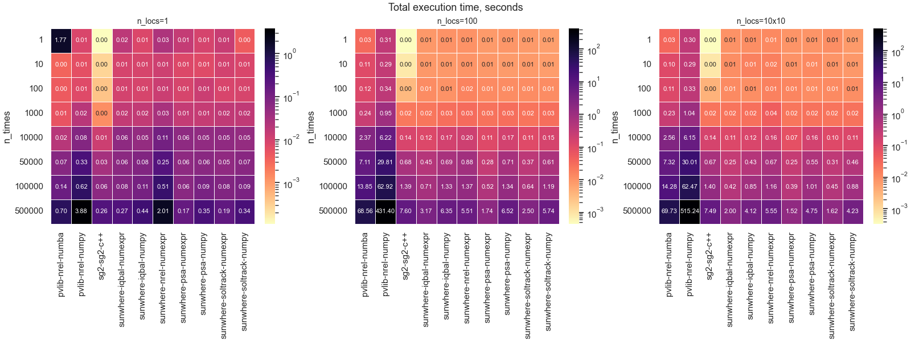

TODO:
- [x] add documentation to README.md (images with folding code in usage showcases)
- [ ] add solar chart with optional analemas in main.py
- [ ] download of csv benchmark in public repo
- [x] explanation of azimuth

# Solar position for solar resource assessment


*sunwhere* is tailored for typical applications in solar resource assessment 🌞. It provides the solar zenith and azimuth angles, the sun-earth's distance correction factor, and secondary parameters such as solar declination, equation of time, and sunrise and sunset times, among others.

## Main features
*sunwhere* optionally uses the NREL[^1], Plataforma Solar de Almería (PSA)[^2], SolTrack[^3] or Iqbal[^4] solar position algorithms (or SPAs), which provide alternative levels of [accuracy and speed](https://github.com/jararias/sunwhere/tree/main#benchmark-which-spa-to-choose) for each application's requirements.

*sunwhere* focuses on usage cases to optimize the computing performance. Three cases are specifically considered that hopefully cover most practical situations:

- [_sunwhere.sites_](./api-docs/usecases.md#function-sites), intended to evaluate the solar position across any number of arbitrary locations throughout a common time grid.

- [_sunwhere.regular_grid_](./api-docs/usecases.md#function-regular_grid), intended for lon-lat regular grids throughout a common time grid.

- [_sunwhere.transect_](./api-docs/usecases.md#function-transect), intended for changing locations over time (e.g., scanning path of a satellite sensor).

Conversely, other packages only consider single-location calculations, having to iterate over each location in multi-site evaluations.

*sunwhere* returns a [Sunpos instance](api-docs/base.md) that provides access to the results via xarray [DataArrays](https://docs.xarray.dev/en/stable/generated/xarray.DataArray.html) that adapt to each specific usage case and provide access to the rich xarray's [API](https://docs.xarray.dev/en/latest/api.html#).

[^1]: Reda I and Andreas A, 2003. Solar Position Algorithm for Solar Radiation Applications. 55 pp.; NREL Report No. TP-560-34302, Revised January 2008 [pdf](http://www.nrel.gov/docs/fy08osti/34302.pdf) [url](https://midcdmz.nrel.gov/spa/).
[^2]: Blanco, M. et al. 2020. Updating the PSA sun position algorithm. Solar Energy, Vol. 212, pp. 339-341, and Blanco-Muriel, M. et al. 2001. Computing the solar vector. Solar Energy, Vol. 70, pp. 431-441 [url](https://doi.org/10.1016/j.solener.2020.10.084).
[^3]: van der Sluys M and van Kan P, 2022. SolTrack: a free, fast and accurate routine to compute the position of the Sun [url](https://doi.org/10.48550/arXiv.2209.01557) [code](https://github.com/MarcvdSluys/SolTrack-Python)
[^4]: Iqbal, M., An introduction to solar radiation. Academic Press. 1983 [url](https://www.sciencedirect.com/book/9780123737502/an-introduction-to-solar-radiation)

## Installation

```sh
python3 -m pip install git+https://github.com/jararias/sunwhere@main
```

<!-- If you want to run the *sunwhere*'s benchmark script, first, be sure that all dependences are installed:

```sh
python3 -m pip install "sunwhere[benchmark] @ git+https://github.com/jararias/sunwhere@main"
```

> [!NOTE]
> See examples in https://pip.pypa.io/en/stable/cli/pip_install/#examples. See also [PEP 440](https://peps.python.org/pep-0440/#direct-references) for usage of @.

Or, from a cloned local copy:

```sh
python3 -m pip install <path_to_local_copy>/.[benchmark]
``` -->

## Usage showcases

### Case 1. sunwhere.sites

`sunwhere.sites` requires a 1-dim sequence of times (if they are not timezone-aware, UTC is assumed) and 1-dim arrays of latitude and longitude. They can also be scalars for single-location calculations, but :warning: **the latitude and longitude arrays must have exactly the same length** ⚠️ . They are the geographic coordinates of the locations where solar position will be evaluated.

The following image shows the solar zenith and elevation angles produced at 5 sites randomly selected.


<details>

<summary>Python's code</summary>

```python
import numpy as np
import pylab as pl
import pandas as pd
import cartopy.crs as ccrs

import sunwhere

# select locations randomly...
n_sites = 5
rg = np.random.RandomState(20240307)
lats = -90. + 180*rg.random(n_sites)
lons = -180 + 360*rg.random(n_sites)

# ...and the time grid
times = pd.date_range('2023-01-15', '2023-01-18', freq='1min', inclusive='left', tz='UTC')
# or, using numpy datetime64:
# times = np.arange('2023-01-15', '2023-01-18', np.timedelta64(1, 'm'), dtype='datetime64[ns]')
# However, numpy does not provide good support for time zones if they are needed.

# run sunwhere.sites... len(lats) must be equal to len(lons)!!
sw = sunwhere.sites(times, lats, lons)  # algorithm='psa' refraction=True

print(sw.sza.head())

# draw some results...
pl.rcParams['axes.titlesize'] = 'small'
pl.rcParams['axes.labelsize'] = 'small'
pl.rcParams['xtick.labelsize'] = 'small'
pl.rcParams['ytick.labelsize'] = 'small'
pl.figure(figsize=(12, 6), layout='constrained')
for k in range(len(sw.sza.location)):
    pl.subplot(2, 3, k+2)
    sw.sza.isel(location=k).plot(label='zenith')
    sw.elevation.isel(location=k).plot(label='elevation')
pl.legend()

# draw the locations in a map...
ax = pl.subplot(231, projection=ccrs.PlateCarree())
location = sw.sza.coords['location'].to_numpy()
latitude = sw.sza.coords['latitude'].to_numpy()
longitude = sw.sza.coords['longitude'].to_numpy()
for loc, lon, lat in zip(location, longitude, latitude):
    ax.plot(lon, lat, 'r.', ms=8)
    ax.text(lon, lat, loc, ha='left', va='bottom')
ax.coastlines(lw=0.5, color='0.5')
ax.set_global()

pl.show()
```
</details>

### Case 2. sunwhere.regular_grid

As `sunwhere.sites`, `sunwhere.regular_grid` requires a 1-dim sequence of times (if they are not timezone-aware, UTC is assumed) and 1-dim arrays of latitude and longitude. However, the length of the latitude and longitude arrays does not have to be necessarily the same. Now, they represent **the rectangular coordinates of the lon-lat regular grid**.

The following image shows the solar zenith angle (left column), the cosine of solar zenith angle, which is important for the evaluation of solar irradiance (middle column), and the cosine of the incidence angle for a plane of array with an inclination of 30&#x00b0; and an azimuth of 60&#x00b0;. The calculations are performed over a regular grid with 1&#x00b0; cellsize.


<details>

<summary>Python's code</summary>

```python
import numpy as np
import pylab as pl
import cartopy.crs as ccrs

import sunwhere

# select the spatial grid...
lats = np.arange(-89.5, 90, 1)
lons = np.arange(-179.5, 180, 1)

# ...and the time grid
times = np.arange('2023-01-15', '2023-01-16', np.timedelta64(6, 'h'), dtype='datetime64[ns]')
# or: times = pd.date_range('2023-01-15', '2023-01-18', freq='1min', inclusive='left')

# run sunwhere.sites...
sw = sunwhere.regular_grid(times, lats, lons)  # algorithm='psa' refraction=True

print(sw.sza.head())

# draw some results...
pl.rcParams['axes.titlesize'] = 'small'
pl.rcParams['axes.labelsize'] = 'small'
pl.rcParams['xtick.labelsize'] = 'small'
pl.rcParams['ytick.labelsize'] = 'small'
pl.figure(figsize=(14, 8), layout='constrained')
for k in range(len(sw.sza.time)):
    ax = pl.subplot(4, 3, 3*k+1, projection=ccrs.PlateCarree())
    sw.sza.isel(time=k).plot(ax=ax, cmap='inferno_r')
    ax.coastlines(lw=0.3, color='w')
    ax = pl.subplot(4, 3, 3*k+2, projection=ccrs.PlateCarree())
    sw.cosz.isel(time=k).plot(ax=ax, cmap='RdBu_r')
    ax.coastlines(lw=0.5, color='0.3')
    ax = pl.subplot(4, 3, 3*k+3, projection=ccrs.PlateCarree())
    sw.incidence(30, 60).isel(time=k).plot(ax=ax, cmap='RdBu_r')
    ax.coastlines(lw=0.5, color='0.3')

pl.show()
```
</details>

### Case 3. sunwhere.transect

As in the former cases, `sunwhere.transect` requires a 1-dim sequence of times (if they are not timezone aware, UTC is assumed) and 1-dim arrays of latitude and longitude. In this case, however, :warning: **the length of the three arrays must be the same** :warning:.

The following figure exemplifies some potential uses of `sunwhere.transect`.


<details>

<summary>Python's code</summary>

```python
import numpy as np
import pylab as pl
import pandas as pd
import cartopy.crs as ccrs

import sunwhere


def build_transect_path(time0, lat0, lon0, t_sim, dt, vx, vy):
    # vx and vy are velocities in degrees/hour
    time1 = time0 + pd.Timedelta(t_sim)
    times = pd.date_range(time0, time1, freq=pd.Timedelta(dt), tz='UTC')
    dlat = vy * (times.freq / pd.Timedelta(1, 'H'))
    lats = lat0 + dlat*np.arange(len(times))
    dlon = vx * (times.freq / pd.Timedelta(1, 'H'))
    lons = lon0 + dlon*np.arange(len(times))
    lons[lons < -180] = lons[lons < -180] % 180
    lons[lons >= 180] = lons[lons >= 180] % -180
    return times, lats, lons


def draw_transect(sunpos, axpos):
    azimuth = sunpos.azimuth
    times = azimuth.coords['time']
    lats = azimuth.coords['latitude']
    lons = azimuth.coords['longitude']
    elevation = sunpos.elevation

    ax = pl.subplot(axpos[0], projection=ccrs.Robinson())
    ax.scatter(lons, lats, marker='.', s=2,
               transform=ccrs.PlateCarree(),
               c=np.array(times, dtype='float64'))
    ax.coastlines(lw=0.5, color='0.5')
    ax.set_global()

    elevation.plot(ax=pl.subplot(axpos[1]))
    pl.ylim(-90, 90)

    azimuth.plot(ax=pl.subplot(axpos[2]))
    pl.ylim(-180, 180)


# starting time and location
time0 = pd.Timestamp('2023-07-15 12')
lat0, lon0 = -40., -120.
ers = 360/24  # earth rotation speed, in degrees/hour

# draw some results...
pl.rcParams['axes.titlesize'] = 'small'
pl.rcParams['axes.labelsize'] = 'small'
pl.rcParams['xtick.labelsize'] = 'small'
pl.rcParams['ytick.labelsize'] = 'small'
pl.figure(figsize=(12, 6), layout='constrained')

times, lats, lons = build_transect_path(
    time0, 40, 0, '23H', '10S', -ers, 0.)
sw = sunwhere.transect(times, lats, lons)  # algorithm='psa' refraction=True
draw_transect(sw, (331, 334, 337))
pl.subplot(331).set_title('Westward transect')

times, lats, lons = build_transect_path(
    time0, -40, 0, '23H', '10S', ers, 0.)
sw = sunwhere.transect(times, lats, lons)  # algorithm='psa' refraction=True
draw_transect(sw, (332, 335, 338))
pl.subplot(332).set_title('Eastward transect')

times, lats, lons = build_transect_path(
    time0, -40, -120, '10H', '10S', 1.2*ers, 0.8*ers)
sw = sunwhere.transect(times, lats, lons)  # algorithm='psa' refraction=True
draw_transect(sw, (333, 336, 339))
pl.subplot(333).set_title('SW-NE transect')

pl.show()
```
</details>

### Case 4. Command line interface

_sunwhere_ comes also with CLI utilities. See:

```sh
sunwhere --help
```

## Benchmark: which SPA to choose?

_sunwhere_ is equipped with 4 solar position algorithms (abbreviately, SPAs) to perform the solar position calculations, namely: `nrel`, `spa`, `soltrack` and `iqbal`. Hence, a pertinent question in the _sunwhere_'s context is which SPA to choose for the calculations.

There are various factors to account for when one has to decide which SPA to use. Although the accuracy of the ephemerides appears the most obvious one, it might not be always the most relevant. For instance, when working with solar resource assessment, the solar irradiance accuracy is probably more important and, in very large datasets, even the computation times can be determinant to choose one or another. In the analysis that follows, I try to shed some light on these questions.

### Ephemerides accuracy

As the truth reference to evaluate the accuracy of the ephemerides calculated with _sunwhere_, I use the [JPL Horizons service](https://ssd.jpl.nasa.gov/horizons/). In particular, I have retrieved the ephemerides at (36.949N, 3.822W) for the whole year 2024 with 12-min time step. In addition, I added the ephemerides calculated also with [pvlib](https://pvlib-python.readthedocs.io/en/stable/) and [sg2](https://github.com/gschwind/sg2)[^5]. The following plot shows the distributions of the absolute differences of the solar zenith and azimuth angles against those obtained from the JPL Horizons service. (Note the logarithmic error scale.)

[^5]: Blanc P. and L. Wald, 2012. The SG2 algorithm for a fast and accurate computation of the position of the sun for multi-decadal time period. Solar Energy Vol. 88, pp. 3072-3083 [url](https://doi.org/10.1016/j.solener.2012.07.018).


The SPAs seem organized in three accuracy classes: IQBAL alone in one group; PSA, SOLTRACK and EPHEMERIS, in a higher-accuracy group; and NREL and PYEPHEM, and maybe SG2 too, in another group with even higher accuracy. The zenith and azimuth errors are similar in any case.

The next table shows numerical results for the solar zenith angle errors. The rows are organized by increasing RMSE. The columns ±CI66 and ±CI90 are the symmetric intervals around MBE that encompass 66% and 90% of the errors, respectively. These results show more clearly that the NREL SPA has the smaller overall deviation with respect to the JPL ephemerides (0.182 arc-sec RMSE) and that both PYEPHEM and SG2 have slightly greater deviations, but still significantly lower than the rest of SPAs.

| zenith (units: arc-sec)       |     MBE |     STD |   ±CI66 |    ±CI90 |     MAE |    RMSE |
|:------------------------------|--------:|--------:|--------:|---------:|--------:|--------:|
| sunwhere's NREL (numexpr)     | 0.024   | 0.180   | 0.166   | 0.299    |   0.142 |   0.182 |
| pvlib's NREL (numba)          | 0.024   | 0.181   | 0.166   | 0.299    |   0.143 |   0.182 |
| pvlib's NREL (numpy)          | 0.024   | 0.181   | 0.166   | 0.299    |   0.143 |   0.182 |
| pvlib's PYEPHEM               | -0.012  | 0.306   | 0.294   | 0.514    |   0.241 |   0.306 |
| sg2's SG2 (c++)               | 0.022   | 0.576   | 0.553   | 0.980    |   0.462 |   0.577 |
| sunwhere's PSA (numexpr)      | 0.162   | 4.227   | 3.758   | 7.282    |   3.198 |   4.230 |
| sunwhere's PSA (numpy)        | 0.162   | 4.228   | 3.753   | 7.280    |   3.201 |   4.231 |
| sunwhere's SOLTRACK (numexpr) | -0.043  | 6.875   | 6.586   | 11.834   |   5.422 |   6.876 |
| sunwhere's SOLTRACK (numpy)   | -0.043  | 6.876   | 6.586   | 11.835   |   5.422 |   6.876 |
| pvlib's EPHEMERIS             | -7.271  | 8.386   | 8.584   | 13.690   |   8.753 |  11.100 |
| sunwhere's IQBAL (numexpr)    | -15.341 | 732.795 | 805.551 | 1117.969 | 648.974 | 732.948 |
| sunwhere's IQBAL (numpy)      | -15.341 | 732.795 | 805.551 | 1117.969 | 648.974 | 732.948 |

_These results are nice but tell us nothing, or little, about the SPA that we should use to evaluate solar radiation_ 😞. Indeed, there might be one or more SPAs that we probably shouldn't use (perhaps, IQBAL), or maybe, even IQBAL is more than enough, despite its large errors. For this reason, I show next a similar analysis that focuses on the impact of these deviations in the evaluation of solar radiation.

### Solar radiation accuracy

For this analysis, I use the SPARTA[^6] ☀️ clear-sky solar radiation model. To do so, I evaluate the differences between the SPARTA's solar irradiances when the solar zenith angle and the sun-earth distance correction factor are obtained from the JPL Horizons service and when they are computed using the SPAs. The impact of the solar position deviations is potentially important for state-of-the-art clear-sky models, given their high performance. Should clouds were included in the solar radiation modelling, the expected overall errors would likely grow to the point that the errors associated to solar position inaccuracies are negligible.

[^6]: Ruiz-Arias, JA, 2023. SPARTA: Solar parameterization for the radiative transfer of the cloudless atmosphere. Renewable and Sustainable Energy Reviews, Vol. 188, 113833 [url](https://doi.org/10.1016/j.rser.2023.113833)

To run SPARTA, I assume an average (kind of rural) clear-sky atmosphere. The results are shown in the tables below.

| GHI (units: W m&#x207b;&#x00b2;) |    MBE |   STD |   ±CI66 |   ±CI90 |   MAE |   RMSE |
|:---------|-------:|------:|--------:|--------:|------:|-------:|
| SG2      | -0.027 | 0.024 |   0.025 |   0.039 | 0.027 |  0.036 |
| NREL     | -0.027 | 0.024 |   0.025 |   0.040 | 0.027 |  0.036 |
| PSA      | -0.029 | 0.041 |   0.038 |   0.063 | 0.036 |  0.050 |
| SolTrack | -0.028 | 0.045 |   0.044 |   0.074 | 0.041 |  0.053 |
| IQBAL    |  0.031 | 2.922 |   3.257 |   4.734 | 2.483 |  2.922 |

| DNI (units: W m&#x207b;&#x00b2;) |    MBE |   STD |   ±CI66 |   ±CI90 |   MAE |   RMSE |
|----------|--------|-------|---------|---------|-------|--------|
| SG2      | -0.031 | 0.021 |   0.024 |   0.033 | 0.031 |  0.037 |
| NREL     | -0.031 | 0.021 |   0.025 |   0.032 | 0.031 |  0.037 |
| PSA      | -0.032 | 0.044 |   0.043 |   0.072 | 0.043 |  0.055 |
| SolTrack | -0.032 | 0.052 |   0.049 |   0.084 | 0.049 |  0.061 |
| IQBAL    |  0.021 | 2.851 |   2.139 |   4.942 | 2.024 |  2.851 |

| DIF (units: W m&#x207b;&#x00b2;) |    MBE |   STD |   ±CI66 |   ±CI90 |   MAE |   RMSE |
|----------|--------|-------|---------|---------|-------|--------|
| SG2      | -0.006 | 0.004 |   0.005 |   0.006 | 0.006 |  0.007 |
| NREL     | -0.006 | 0.004 |   0.005 |   0.006 | 0.006 |  0.007 |
| PSA      | -0.006 | 0.008 |   0.008 |   0.013 | 0.008 |  0.010 |
| SolTrack | -0.006 | 0.009 |   0.009 |   0.016 | 0.009 |  0.011 |
| IQBAL    |  0.004 | 0.522 |   0.494 |   0.870 | 0.407 |  0.522 |

These results clearly show that **the uncertainty in modelled clear-sky solar irradiance that is attributable to uncertainty in solar position is negligible with all SPAs except IQBAL** because they induce errors below 1 W m&#x207b;&#x00b2; (much higher with IQBAL), which are negligible compare even to solar radiation observational errors.

Hence, **computing time surfaces as a key feature to decide which is the best SPA**.

### Computing time

The plots below summarize the performance tests conducted in three different situations in my modest [6-core](https://www.intel.la/content/www/xl/es/products/sku/196448/intel-core-i710710u-processor-12m-cache-up-to-4-70-ghz/specifications.html), 32 GB RAM, 6.1.71-1-MANJARO (64 bits), desktop computer. The plots show total execution times obtained as the average of three repeated calculations using python [timeit](https://docs.python.org/3/library/timeit.html#module-timeit).



The first case (left plot) is for single-location calculations, for time series of several lenghts from 1 to 500,000 time steps. (50,000 time steps is about one month of 1-min time steps and 500,000 is about one year of 1-min time steps.) Note the logarithmic color scale. If, according to the previous solar irradiance analysis, we don't distinguish between SPAs other than IQBAL, the fastest are the _sunwhere_'s _numexpr_ PSA and SolTrack. However, should we need higher accuracy, then NREL (or even SG2) should be considered. In such case, the fastest options would be the pvlib's numba NREL or SG2. However, the former requires on-the-fly compilation which may discourage its use for short time series. In any case, the total execution times here are so small in either case that, in practice, nearly all SPAs are equivalent in terms of simulation speed.

The second case (middle plot) is for multi-site calculations (100 sites) over a common time grid. Here, _sunwhere_ starts shining over all other SPAs, especially for long time series, when the execution times are not negligible (in contrast with the single-location case). For instance, the _sunwhere_'s _numexpr_ NREL is about 11 times faster than the pvlib's _numba_ NREL and about 80 times faster than the pvlib's _numpy_ NREL. SG2 has also an outstanding performance, only 2 seconds slower. However, the _sunwhere_'s _numexpr_ PSA is much faster, since it requires only 1.7 seconds to compute the ephemerides for the the 100 locations over a time grid of 500,000 time steps.

The results are even more favorable to _sunwhere_ in the third case (right plot) which evaluates the execution times in a modest-size 10x10 regular grid. The results would be even more favorable for _sunwhere_ for a greater grids. 

### References

