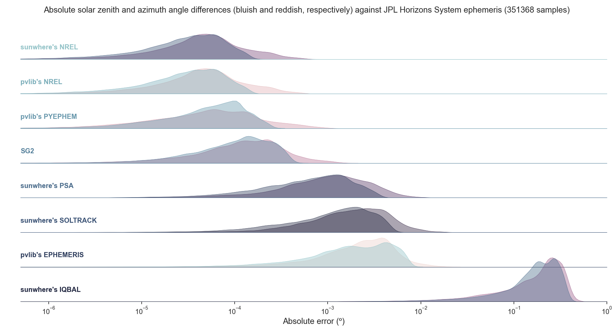
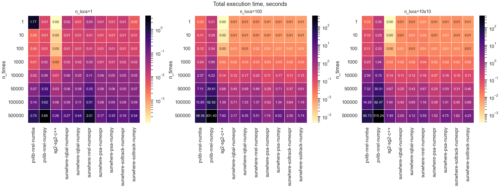

# Benchmarks

This page compares the accuracy and the execution time of the sunwhere algorithms with other solar position packages.

!!! note "About SolTrack"
    The figures include **sunwhere's SOLTRACK**, an internal implementation of the SolTrack algorithm used for development and comparison. It is **not part of the public API**: it is not listed in `sunwhere.SPA_ALGORITHMS`, it is not documented, and it may change or be removed without notice. The public algorithms are `psa` (default), `nrel` and `iqbal`.

## Accuracy

The reference is the [JPL Horizons System](https://ssd.jpl.nasa.gov/horizons/) ephemeris (airless, i.e., without atmospheric refraction), at 351368 samples.

/// caption
Absolute differences of solar zenith angle (bluish) and solar azimuth angle (reddish) against the JPL Horizons ephemeris.
///

- **NREL** is as accurate as pvlib's NREL implementation (errors around 10⁻⁴°).
- **PSA** has errors around 10⁻³°, which is more than enough for solar resource applications. Its coefficients are tuned for 2020-2050.
- **Iqbal** has errors around 0.1-0.5°. It is useful for teaching or for low-accuracy applications.

## Execution time

/// caption
Total execution time, in seconds, for 1 location, 100 scattered locations and a regular grid of 10×10 locations, against the number of time steps.
///

Some examples from the figure, for 500000 time steps and 100 locations:

| Package (algorithm, engine)    | Time (s) |
| :----------------------------- | -------: |
| sunwhere (PSA, numexpr)        |     1.7  |
| sunwhere (NREL, numexpr)       |     5.5  |
| pvlib (NREL, numba)            |    68.6  |
| pvlib (NREL, numpy)            |   431.4  |

That is, sunwhere's NREL is about 12x faster than pvlib's NREL with numba, and about 80x faster than pvlib's NREL with numpy. The advantage grows with the number of locations.

!!! info "Start-up overhead"
    For a single location and short time series (e.g., one year of hourly data), sunwhere can be slower than other packages. Each call validates its inputs and builds the xarray outputs, and this fixed cost dominates when there are few calculations. The advantage of sunwhere appears with many time steps and, above all, with many locations.

The benchmarks can be reproduced with the scripts in the [examples](https://github.com/jararias/sunwhere/tree/main/examples) directory of the repository.
