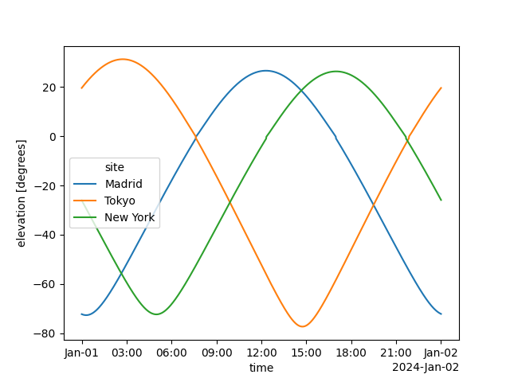
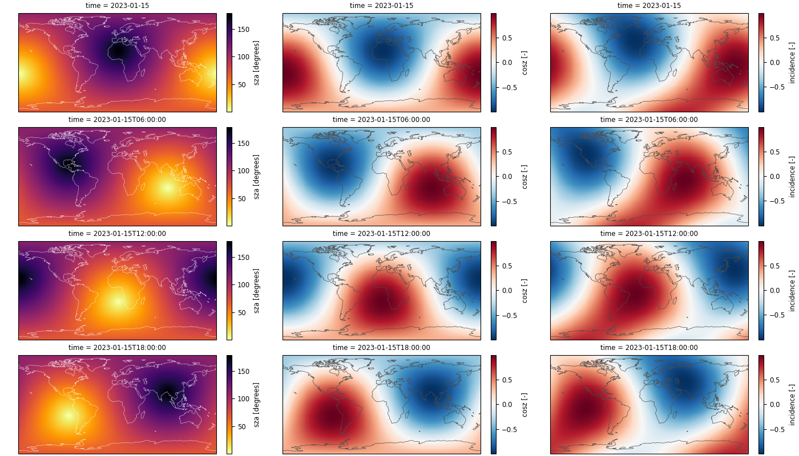
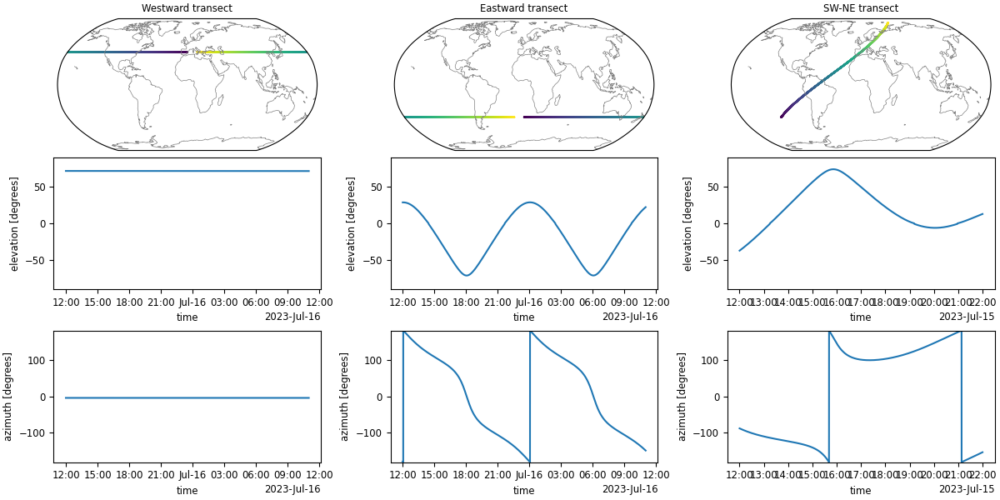

# Solar Position For Solar Resource Assessment


  

**sunwhere** is a Python library designed *for fast and accurate calculations of solar position* for solar resource applications 🌞.

*sunwhere* provides solar zenith and azimuth angles, sun-earth distance correction factor, and secondary parameters such as solar declination, equation of time, and many more. It's optimized for typical workflows in solar energy research and engineering.

## Key Features

#### Multiple solar position algorithms

Choose the solar position algorithm (SPA) that best fits your accuracy and performance needs:

- *NREL's SPA*: Valid for years -2000 to 6000, is the most accurate (±0.0003°) but the slowest too. It is probably adequate for single-location (or few) time series but not for time series of regular grids of sites.
- *PSA's SPA* (Plataforma Solar de Almería): Now with updated coefficients tuned for 2020 to 2050, is a blazing fast *default* in sunwhere.
- *Iqbal's SPA*: The elderly guy, good for educational/low-accuracy applications

#### Optimized for common use cases

Three specialized functions cover most practical scenarios:

1. **`sites()`** - Multiple arbitrary locations with common time grid
2. **`regular_grid()`** - Lat-lon regular grids (ideal for spatio-temporal data)
3. **`transect()`** - Moving observers (satellites, aircraft, ships)

Table 1 compares execution times of sunwhere and two popular packages for solar position calculations, [pvlib](https://pvlib-python.readthedocs.io/en/stable/) and [solposx](https://solposx.readthedocs.io/en/latest/), using a year of minutely data as a baseline.

| Package (algorithm, engine)        |    1 site (ms)   |    10 sites (ms)   |
| :--------------------------------- | :--------------: | :----------------: |
| **sunwhere** (PSA, numexpr)        |   **224 ± 25**   |   **602 ± 21**     |
| **sunwhere** (PSA, numpy)          |   **387 ± 40**   |   **1055 ± 11**    |
| **solposx** (PSA, numpy)           |     406 ±  84    |     3312 ± 125     |
| **pvlib** (Ephemeris, numpy)       |     572 ±  96    |     4256 ±  69     |
| **sunwhere** (NREL, numexpr)       |    2074 ±  58    |     2512 ±  40     |
| **pvlib** (NREL, numba)            |    5080 ± 156    |    50255 ± 783     |
| **solposx** (SPA "NREL", numpy)    |    5114 ±  92    |    51348 ± 1597    |

/// table-caption
Table 1. Execution time (average of 10 runs ± standard deviation) for a year of minutely data in a single location and in 10 locations randomly chosen.
///

??? info  "**sunwhere is the top performer** in both cases 1 location and 10 locations"

     - For one location, the differences are not significant, in practice, when using *PSA* but they are remarkable when using *NREL* (sunwhere is few seconds faster than both pvlib and solpos).
     - For 10 locations, sunwhere is significantly faster than both pvlib and solposx when using *PSA* and embarrasingly faster when using *NREL* (sunwhere is about 100x faster then both pvlib and solposx).
     - For one location and hourly data, the differences between models are still not significant and sunwhere can be slower than the other two packages due to starting penalties.
     - As the number of locations grows beyond 10, the differences in favor of sunwhere are even larger.

#### Modern Data Structures

Results are returned as [xarray DataArrays](https://docs.xarray.dev/en/stable/generated/xarray.DataArray.html), providing:

- Labeled dimensions and coordinates
- Rich metadata
- Integration with the scientific Python ecosystem
- Seamless saving to NetCDF, Zarr, and other formats

## Quick examples

**Example (sites):** Solar position in multiple sites with common time grid

```python
import matplotlib.pyplot as plt
import pandas as pd
import sunwhere

# Define locations and times
times = pd.date_range('2024-01-01', '2024-01-02', freq='1min', tz='UTC')
cities = {
    'Madrid': (40.4, -3.7),
    'Tokyo': (35.7, 139.7),
    'New York': (40.7, -74.0)
}
lats = [coord[0] for coord in cities.values()]
lons = [coord[1] for coord in cities.values()]

# Calculate solar position
result = sunwhere.sites(times, lats, lons, site_names=list(cities), algorithm='nrel')

# solar zenith angle in Madrid
print(result.zenith.sel(site='Madrid'))

# or selecting by index
print(result.zenith.isel(site=0))

result.elevation.plot.line(x='time', hue='site')
plt.show()
```
??? info "Check output"

    <p align="center">
      
    </p>


**Example (regular_grid):** Solar position on a regular grid of locations

```python
import numpy as np
import matplotlib.pyplot as plt
import cartopy.crs as ccrs

import sunwhere

# select the spatial grid...
lats = np.arange(-89.5, 90, 1)
lons = np.arange(-179.5, 180, 1)

# ...and the time grid
times = np.arange('2023-01-15', '2023-01-16', np.timedelta64(6, 'h'), dtype='datetime64[ns]')
# or: times = pd.date_range('2023-01-15', '2023-01-16', freq='6h', inclusive='left')

result = sunwhere.regular_grid(times, lats, lons)  # algorithm=psa by default

# draw some results...
plt.rcParams['axes.titlesize'] = 'small'
plt.rcParams['axes.labelsize'] = 'small'
plt.rcParams['xtick.labelsize'] = 'small'
plt.rcParams['ytick.labelsize'] = 'small'
plt.figure(figsize=(14, 8), layout='constrained')
for k in range(len(result.sza.time)):
    ax = plt.subplot(4, 3, 3*k+1, projection=ccrs.PlateCarree())
    result.sza.isel(time=k).plot(ax=ax, cmap='inferno_r')
    ax.coastlines(lw=0.3, color='w')
    ax = plt.subplot(4, 3, 3*k+2, projection=ccrs.PlateCarree())
    result.cosz.isel(time=k).plot(ax=ax, cmap='RdBu_r')
    ax.coastlines(lw=0.5, color='0.3')
    ax = plt.subplot(4, 3, 3*k+3, projection=ccrs.PlateCarree())
    result.incidence(30, 60).isel(time=k).plot(ax=ax, cmap='RdBu_r')
    ax.coastlines(lw=0.5, color='0.3')

plt.show()
```
??? info "Check output"

    <p align="center">
      
    </p>

**Example (transect):** Solar position through a transect

```python
import numpy as np
import matplotlib.pyplot as plt
import pandas as pd
import cartopy.crs as ccrs

import sunwhere

def build_transect_path(time0, lat0, lon0, t_sim, dt, vx, vy):
    # vx and vy are velocities in degrees/hour
    time1 = time0 + pd.Timedelta(t_sim)
    times = pd.date_range(time0, time1, freq=pd.Timedelta(dt), tz='UTC')
    dlat = vy * (times.freq / pd.Timedelta(1, 'h'))
    lats = lat0 + dlat*np.arange(len(times))
    dlon = vx * (times.freq / pd.Timedelta(1, 'h'))
    lons = lon0 + dlon*np.arange(len(times))
    lons[lons < -180] = lons[lons < -180] % 180
    lons[lons >= 180] = lons[lons >= 180] % -180
    return times, lats, lons

def draw_transect(sunpos, axpos):
    azimuth = sunpos.azimuth
    times = azimuth.coords['time']
    lats = azimuth.coords['lat']
    lons = azimuth.coords['lon']
    elevation = sunpos.elevation

    ax = plt.subplot(axpos[0], projection=ccrs.Robinson())
    kwargs = {"transform": ccrs.PlateCarree(), "c": np.array(times, dtype=float)}
    ax.scatter(lons, lats, marker='.', s=2, **kwargs)
    ax.coastlines(lw=0.5, color='0.5')
    ax.set_global()

    elevation.plot(ax=plt.subplot(axpos[1]))
    plt.ylim(-90, 90)

    azimuth.plot(ax=plt.subplot(axpos[2]))
    plt.ylim(-180, 180)

# starting time and location
time0 = pd.Timestamp('2023-07-15 12')
lat0, lon0 = -40., -120.
ers = 360/24  # earth rotation speed, in degrees/hour

# draw some results...
plt.rcParams['axes.titlesize'] = 'small'
plt.rcParams['axes.labelsize'] = 'small'
plt.rcParams['xtick.labelsize'] = 'small'
plt.rcParams['ytick.labelsize'] = 'small'
plt.figure(figsize=(12, 6), layout='constrained')

times, lats, lons = build_transect_path(time0, 40, 0, '23h', '10s', -ers, 0.)
result = sunwhere.transect(times, lats, lons)  # algorithm='psa' refraction=True
draw_transect(result, (331, 334, 337))
plt.subplot(331).set_title('Westward transect')

times, lats, lons = build_transect_path(time0, -40, 0, '23h', '10s', ers, 0.)
result = sunwhere.transect(times, lats, lons)  # algorithm='psa' refraction=True
draw_transect(result, (332, 335, 338))
plt.subplot(332).set_title('Eastward transect')

times, lats, lons = build_transect_path(time0, -40, -120, '10h', '10s', 1.2*ers, 0.8*ers)
result = sunwhere.transect(times, lats, lons)  # algorithm='psa' refraction=True
draw_transect(result, (333, 336, 339))
plt.subplot(333).set_title('SW-NE transect')

plt.show()
```
??? info "Check output"

    <p align="center">
      
    </p>

## Getting Started

Ready to use sunwhere? Check out the [Installation](installation.md) guide and the [User Guide](user-guide.md) to get started!

## References

- **NREL SPA**: Reda, I. and Andreas, A., 2003. Solar Position Algorithm for Solar Radiation Applications. NREL Report No. TP-560-34302. [PDF](http://www.nrel.gov/docs/fy08osti/34302.pdf)

- **PSA Algorithm**: Blanco, M. et al., 2020. Updating the PSA sun position algorithm. Solar Energy, 212, 339-341. [DOI](https://doi.org/10.1016/j.solener.2020.10.084)

- **Iqbal Algorithm**: Iqbal, M., 1983. An introduction to solar radiation. Academic Press.

## License

sunwhere is licensed under CC BY-NC-SA 4.0 - free for non-commercial use.

## Citation

If you use sunwhere in your research, please cite:

```bibtex
@software{sunwhere2024,
  author = {Ruiz-Arias, Jose A.},
  title = {sunwhere: Solar position for solar resource assessment},
  year = {2024},
  url = {https://github.com/jararias/sunwhere}
}
```
